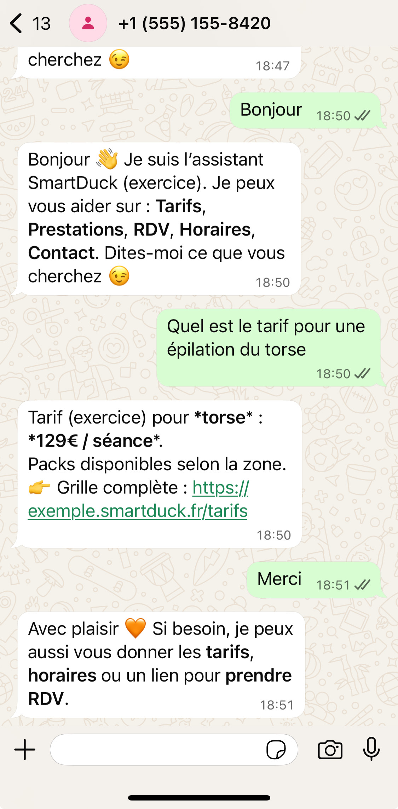
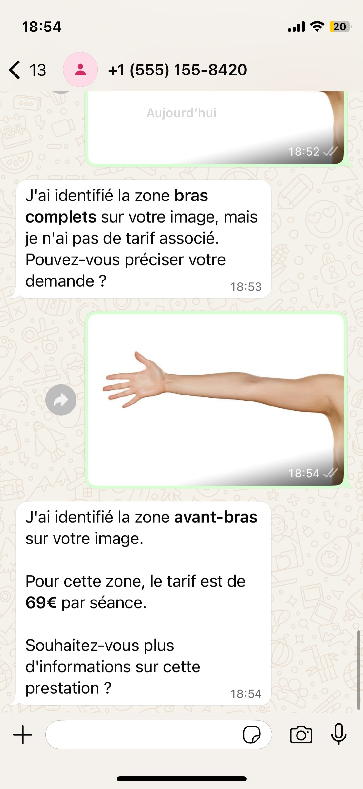
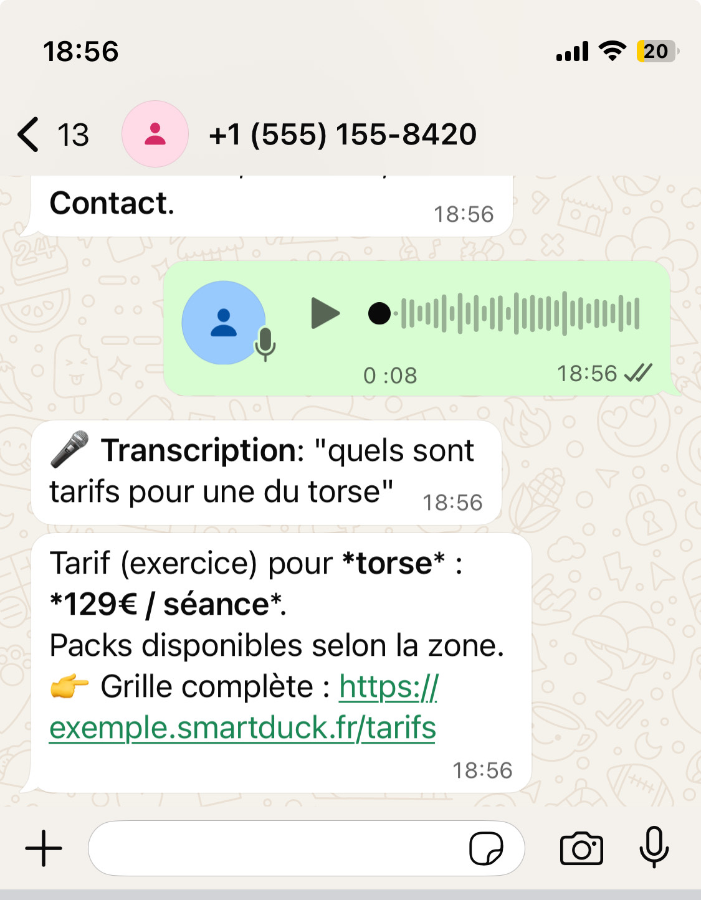

# 🦆 SmartDuck WhatsApp Bot

Un **assistant conversationnel intelligent** pour les services d'épilation laser, développé avec **Node.js**, **TypeScript** et l’**API WhatsApp Cloud de Meta**.  
Ce bot répond automatiquement aux questions des clients, fournit les **tarifs**, gère les **rendez-vous**, transcrit les **messages vocaux**, et peut même **analyser les images** pour identifier les zones corporelles à traiter.

---

## 📚 Sommaire

- [Introduction](#introduction)
- [Fonctionnalités](#fonctionnalités)
- [Technologies utilisées](#technologies-utilisées)
- [Installation et configuration](#installation-et-configuration)
- [Structure du projet](#structure-du-projet)
- [Fonctionnement](#fonctionnement)
- [Captures d'écran](#captures-décran)
- [Améliorations possibles](#améliorations-possibles)
- [Développement et contribution](#développement-et-contribution)

---

## 🧠 Introduction

**SmartDuck WhatsApp Bot** est une solution complète d’assistance virtuelle dédiée aux établissements d’épilation laser.  
Son objectif est de **simplifier la communication client via WhatsApp**, d’offrir une expérience fluide et de **répondre instantanément aux demandes fréquentes**.

Le bot est capable de :
- Identifier l’intention d’un utilisateur (tarif, horaire, prestation…)
- Répondre de manière contextuelle et naturelle
- Traiter des **messages texte, audio et image**
- Fournir des **liens de réservation**, **tarifs**, et **informations pratiques**

> 💡 Ce projet est à la fois un exercice technique et une base solide pour une automatisation réelle.

---

## ⚙️ Fonctionnalités

### 💬 Traitement des messages texte
- Détection d’intentions via **expressions régulières** et **fuzzy matching**
- Reconnaissance d’entités : zones corporelles, villes, horaires, etc.
- Réponses dynamiques à partir d’une **base JSON** (`data.json`)
- Quick replies pour une navigation fluide

### 🎙️ Traitement audio
- Réception des **messages vocaux WhatsApp**
- **Transcription via Deepgram API** (ou autre STT provider configurable)
- Traitement du texte transcrit comme un message standard

### 🖼️ Analyse d'images (WIP)
Le bot utilise **TensorFlow.js** et **BodyPix** pour analyser les images envoyées par l'utilisateur.

- Utilisation de `@tensorflow/tfjs-node` pour l'exécution des modèles en Node.js
- Segmentation des parties du corps via le modèle `@tensorflow-models/body-pix`
- Détection des zones corporelles pour estimer les tarifs d'épilation
- Analyse basée sur un modèle pré-entraîné qui reconnaît différentes parties du corps
- Conversion d'images en tenseurs et traitement optimisé pour la détection

Le processus inclut le chargement du modèle, le prétraitement de l'image, la segmentation et l'interprétation des résultats pour identifier les zones corporelles principales.

### 📘 Base de connaissances
- Tarifs par zone et par pack
- Horaires et adresses des établissements
- Protocole avant/après séance
- Informations générales et FAQ

### 📅 Gestion des rendez-vous
- Redirection vers le système de réservation (URL factice, mais configurable dans le cas d'une utilisation professionnelle)
- Informations sur les disponibilités par ville

---

## 🛠️ Technologies utilisées

| Domaine | Technologie                              |
|----------|------------------------------------------|
| **Backend** | Node.js, TypeScript, Express             |
| **API** | WhatsApp Cloud API (Meta)                |
| **NLP** | Regex, fuzzy matching, JSON d’intentions |
| **Speech-to-Text** | Deepgram API (configurable)              |
| **Analyse d’image** | Tensorflow BodyPix                       |
| **Configuration** | dotenv                                   |
| **Logging** | Winston logger personnalisé              |

---

## ⚙️ Installation et configuration

### 🔧 Prérequis
- Node.js **v16+**
- Compte **Meta for Developers**
- **Numéro WhatsApp Business** associé
- Clé **API Deepgram** *(optionnelle pour le STT)*

---

### 📦 Installation

```bash
# Cloner le dépôt
git clone https://github.com/votre-compte/whatsapp_bot.git
cd whatsapp_bot

# Installer les dépendances
npm install

# Copier et éditer les variables d'environnement
cp .env.example .env
```

---

### ⚙️ Configuration des variables d'environnement

```bash
# WhatsApp Cloud API (Meta)
WHATSAPP_TOKEN=votre_token_whatsapp
WHATSAPP_VERIFY_TOKEN=votre_token_verification
WHATSAPP_API_BASE=https://graph.facebook.com/v21.0
WHATSAPP_PHONE_NUMBER_ID=votre_id_telephone

# Serveur
PORT=3000
APP_URL=https://votre-url.com

# Speech-to-Text
STT_PROVIDER=deepgram
STT_API_KEY=votre_cle_deepgram
```

---

# 📊 Architecture du data.json

Le fichier data.json est au cœur de l'intelligence du bot - un choix architectural délibéré pour faciliter la maintenance sans dépendre d'une base de données. Ce fichier unique centralise :  
- metadata : Informations de version et marque
- entities : Listes des éléments reconnaissables (zones corporelles, villes...)
- intents : Collection d'intentions utilisateur avec leurs patterns regex et réponses associées
- kb (knowledge base) : Base de connaissances structurée (tarifs, horaires, protocole...)
- routing : Configuration de priorité des intentions
- post_processing : Règles de normalisation des textes et fuzzy matching
Ce modèle offre plusieurs avantages : déploiement simple, modification rapide des contenus sans redéploiement, pas de dépendance externe, et une expérience conversationnelle cohérente. L'approche basée sur les expressions régulières et le fuzzy matching permet une détection d'intention efficace sans nécessiter d'infrastructure ML complexe.

---

### 🚀 Démarrage

```bash
# Démarrer en mode développement
npm run dev

# Construire et démarrer en production
npm run build
npm start
```

---

## 📁 Structure du projet

```
src/
├── config.js                 # Configuration générale de l'app
├── index.ts                  # Point d'entrée principal
├── webhook.ts                # Gestionnaire des webhooks WhatsApp
├── data.json                 # Base de connaissances (intents & réponses)
├── services/
│   ├── dataService.ts        # Gestion des données du bot
│   ├── imageService.ts       # Analyse d'image
│   ├── sttService.ts         # Service de reconnaissance vocale
│   ├── nlp.ts                # Analyse des intentions et entités
│   └── whatsappClient.ts     # Envoi et réception via WhatsApp Cloud API
└── utils/
    ├── logger.js             # Logger Winston
    └── types.ts              # Définitions de types TypeScript
```

---

## ⚙️ Fonctionnement

### 📡 Webhook WhatsApp
Le bot expose deux routes :
| Route | Description |
|--------|--------------|
| `GET /webhook` | Vérification du webhook (Meta) |
| `POST /webhook` | Réception des messages et événements |

---

### 🔄 Traitement d’un message
1. Le webhook reçoit le message utilisateur.
2. Le type est détecté : **texte**, **audio**, **image**.
3. - Si texte → **analyse NLP** (regex/fuzzy).
- Si audio → **transcription via STT** → texte → NLP.
- Si image → **analyse de zone**.
4. Le bot récupère la réponse dans `data.json`.
5. La réponse est envoyée à l’utilisateur via **WhatsApp Cloud API**.

---

### 🖼️ Analyse d'images (WIP)
Le bot utilise **TensorFlow.js** et **BodyPix** pour analyser les images envoyées par l'utilisateur.

- Utilisation de `@tensorflow/tfjs-node` pour l'exécution des modèles en Node.js
- Segmentation des parties du corps via le modèle `@tensorflow-models/body-pix`
- Détection des zones corporelles pour estimer les tarifs d'épilation
- Analyse basée sur un modèle pré-entraîné qui reconnaît différentes parties du corps
- Conversion d'images en tenseurs et traitement optimisé pour la détection

Le processus inclut le chargement du modèle, le prétraitement de l'image, la segmentation et l'interprétation des résultats pour identifier les zones corporelles principales.

---

## 🖼️ Captures d'écran

Exemples d'interactions :
- 💬 Conversation de base avec le bot

  <p align="center">
    
  </p>

- 🖼️ Analyse d'une image

  <p align="center">
    
  </p>

- 🎙️ Transcription audio

  <p align="center">
    
  </p>

---

## 🚀 Améliorations possibles

### 🔬 Analyse d'image avancée
- Utilisation de modèles ML plus sophistiqués (ex: google Vision API)

### 🧠 NLP amélioré
- Modèle de classification d’intentions (Naive Bayes / ML)
- Gestion de sessions utilisateurs
- Détection d’entités plus robuste

### 🧾 Intégration CRM
- Connexion à un système de gestion de rendez-vous
- Synchronisation des clients (CRM)

### 💳 Paiement & facturation
- Intégration d’un module de paiement (Stripe, PayPal)

### 🌍 Multilingue
- Support complet **FR / EN**
- Détection automatique de la langue
- 
### Améliorations des réponses
- Réponses plus naturelles
- Plus de mots clés

---

## 👩‍💻 Développement et contribution

### Environnement de développement

```bash
# Démarrage avec rechargement à chaud
npm run dev

# Lancer les tests unitaires
npm test

# Vérifier la qualité du code
npm run lint
```

---

Pour exposer l'environnement local :

```bash
ngrok http 3000
```

---

## 🧩 Licence

Ce projet est proposé à titre **éducatif et démonstratif**.

---

## 🦆 Auteur

**Augustin Vathonne**  
💌 augustinvathonne@gmail.com 
🌐 [https://github.com/AV-13](https://github.com/AV-13)

---
